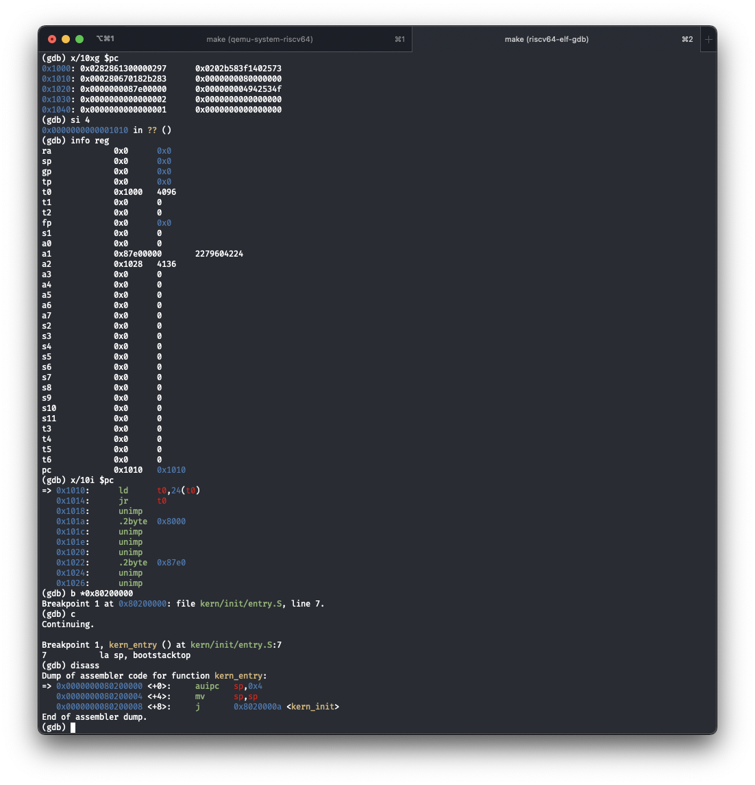

# 第一次实验报告

## Lab 0.5

### 使用GDB 验证 QEMU 中 `virt` 这一机器的启动流程

在 QEMU 中模拟 `virt` 这一机器加电之后得到的指令如上。首先 `t0` 赋值为当前的 `pc` 即 `0x1000`，之后将 `a2` 设置为 `t0 + 40` 即 `0x1028`，之后将当前 hardware thread 寄存器即 `mhartid` 的值读入 `a0` ，将 `t0 + 32 = 0x1020` 位置的值读入 `a1` 将 `t0 + 24 = 0x1018` 处的值读入 `t0` ，并跳转到 `t0` 所存储的地址处。查看当前地址开始的数据（由于是 `ld` 所以查看 64 位双字），

最终跳转到 `0x80000000` 处开始执行 OpenSBI。之后在 `0x80200000` 处下断点并且查看反汇编代码，可以看到 `entry.S` 中的伪代码的翻译结果

1. 硬件加电之后指令的位置

   指令位于 QEMU 所设置的 `reset_vec` 这一模拟的 ROM 中，可以查看 QEMU 中 RISC-V 硬件 boot 的代码

   

   并且在 `virt` 这一虚拟机启动时载入 `reset_vec`

   

2. 硬件加电之后完成的功能

   硬件加电之后的初始化指令会将必要的信息（包括 `fw_dynamic_info` 结构体的位置以及载入Flattened Device Tree, FDT 的地址等）存入 `a0~a2` 寄存器，之后根据 QEMU 中提供的 `start_addr` 跳转到下一级启动流程（即 OpenSBI）来引导后续的程序（此处就是 ucore 的内核）。

### 关于 RISC-V 的启动流程

在 QEMU 的新版本中默认使用了 OpenSBI 的 `fw_dynamic` 这个版本，这一版本并不会直接将操作系统的内核加载到 `0x80200000` 这个位置。而是会根据 `fw_dynamic_info` 进入下一个 boot 阶段（`fw_dynamic_info` 结构体的内容如下）。

与实验中所使用的 `fw_jump` 固件相比，`fw_dynamic_info` 可以从前一个 boot 阶段加载信息并且载入下一阶段的内容，这样的 OpenSBI 可以更好地充当不同硬件平台上一个中间层的存在。目前已有的一些 RISC-V 硬件上的 bootloader 也会将 OpenSBI 作为一个库使用。而实验中所使用的方法，即使用 `fw_jump` 固件跳转到一个固定地址并且将 OpenSBI 直接作为一个 bootloader 的方式是一般 boot 流程[^1 ]的一个简化形式。在实际的硬件开发版中（如 VisonFive2 和 Licheepi4a）会采用将 OpenSBI 作为一个 M-S 两个特权级之间的运行时[^2]，使用 U-Boot 或其他更复杂的 bootloader 作为最后一个 boot 阶段的启动方式[^3]。

[^1]: [An Introduction to RISC-V Boot Flow](https://riscv.org/wp-content/uploads/2019/12/Summit_bootflow.pdf)
[^2]: [OpenSBI Deep Dive](https://riscv.org/wp-content/uploads/2019/06/13.30-RISCV_OpenSBI_Deep_Dive_v5.pdf)
[^3]: [Uncovering the Mysteries of Linux Boot on RISC-V QEMU Machines - A Deep Dive into the Boot Process](https://embeddedinn.com/articles/tutorial/RISCV-Uncovering-the-Mysteries-of-Linux-Boot-on-RISC-V-QEMU-Machines/)

## Lab1

### 内核启动中的程序入口操作

1. `kern/init/entry.S` 中 `la sp, bootstacktop` 是将栈顶指针设置为 `bootstacktop`，由于 `bootstacktop` 与 `bootstack` 之间相隔 `KSTACKSIZE` 即内核栈大小，所以这一操作是为内核开辟栈空间，使内核操作过程中栈能够顺利从高地址向低地址生长。
2. `tail kern_init` 中 `tail` 是一个伪代码，表示尾调用，此处即进入 `kern_init` 初始化函数，并且不设置 `ra` 这一返回地址寄存器。

### 完善中断处理

### RISCV 中断流程

1. `move a0, sp` 表示将 `sp` 作为后面 `jal trap` 中 `trap` 函数的第一个参数。在 `SAVE_ALL` 中，已经将所有的寄存器保存到了 `sp` 开始的一个连续的内存栈空间中，所以 `sp` 的内容即为一个 `trapframe` 开头的地址，将 `sp` 传入 `trap` 函数即指定了 `tf` 这一参数。
