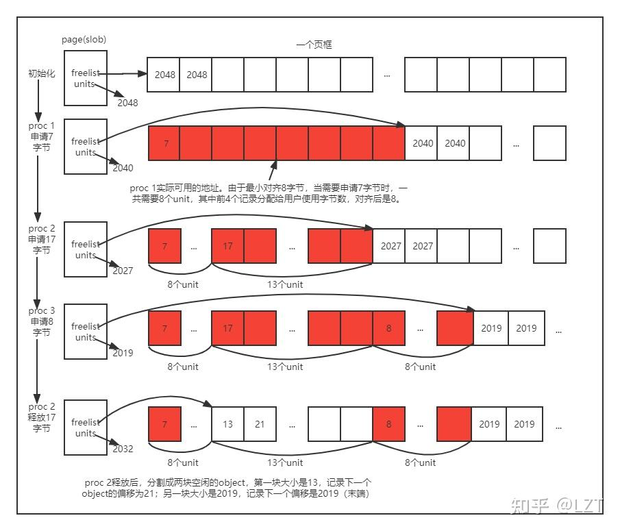

# 第二次实验报告

`pmm_init` 之后的内存布局

```text
+-----------------+ <-- vma: 0xffffffffc0200000
|                 |     pma:         0x80200000
|      KERNEL     |
|                 |
+-----------------+ <-- pma:         0x80206470
|       HOLE      | ---------------> ROUNDUP
+-----------------+ <-- pma:         0x80207000
|                 |
|     `Page`s     | ---------------> Array of `Page` structs
|                 |
+-----------------+ <-- mem_begin (ROUNDUP, but the same)
|                 |     pma:         0x80347000
|       Mem       |
|                 |
+-----------------+ <-- mem_end (ROUNDDOWN, but the same)
                        pma:         0x88000000
```

`Page` 结构体中的 `flags` 的第 0 位和第 1 位分别表示保留和分配。其中第 1 位为 `1` 时代表这个页表示一个内存块的开始，否则可以表示已经被分配或不是内存块的开始（即不能用于分配）。

## Firsr-fit 连续物理内存分配算法

在 `pmm_init` 之后，会使用 `pa2page` 将 `mem_begin` 对应的物理地址转换为对应的 `Page`。并与 `mem_begin` 到 `mem_end` 这一段内存中包含的页的数量一起传入 `init_memmap`，之后再调用 `pmm_manager` 的 `init_memmap`。

对于 `default_pmm_manager`, 其实现方法如下可以分为几个部分。

### 初始化

初始化接受一个开始的页和页的数量。首先检查从 `base` 开始的 `n` 个页是否处于保留状态并且将所有的页的 `flags` 和 `property` 全部设置为 0（不保留，不能分配且块大小为 0），并且重置引用计数。

之后用 `base` 表示一个大内存块的开始，将 `property` 即页数量设置为 `n`，并设置其 `flag` 表示一个内存块的开始，将 `free_area` 中的可用内存页数量加上 `n`。

最后将 `base` 这一内存块对应的 `page_link` 接入链表。

### 分配

首先，若需要分配的页的数量超出了可用内存页的数量则直接返回 `NULL`。

当可以进行分配时，则从 `free_list` 中找到第一个可用的内存块，将其从链表中移除，并且若 选中的内存块中页的数量大于所需的页的数量则将多出部分重新划分内存块，并且插入链表中。

最后，维护 `nr_free` 以及被分配页的 `flags`。

### 回收

首先检查所有待回收的页时候都不被保留并且不能被分配（即已经被分配），并重置 `flags` 和引用计数。之后将 `base` 作为所有回收内存页的内存块的开始，更新内存块大小和 `base` 的 `flags` 以及 `nr_free`。之后重新将这个内存块插入链表并且同时维护链表的有序性。

此外，若此时链表中 `base` 的前一个内存块表示的内存区域与 `base` 恰好相邻，则进行合并并且维护属性。对于后一个内存块也进行这样的合并操作。

## Best-fit 连续物理内存分配算法

默认的内存分配在找到第一个可用的内存块之后便停下直接使用，而 best-fit 则查找一个符合内存大小要求且最小的内存块。在实现 Best-fit 的过程中使用了遍历整个链表的方法，从而查找最小的符合条件的内存块。

在找到内存块之后与 `first-fit` 一样进行分割操作。在内存回收时也同样尝试将内存进行合并同时保证 `free_list` 中的有序性以及维护内存块的一系列属性。

## Buddy System

在 `mm/buddy_pmm.c` 和 `mm/buddy_pmm.h` 下实现了一个使用 Buddy System 的物理内存管理器。Buddy System 将内存页划分为 2 的整数次幂的块，并且在分配时进行分割从而得到最合适的内存块。

### 实现

在实现的过程中首先设计了一个用于管理内存块的数据结构 `buddy_zone_t` 实际上内部就是一个包含了多个 `free_area_t` 的数组，下标即对应这一链表中块的幂次。在实现时最大支持了 11 层链表，也就是将最大的内存块设置为了 `1024` 个页，并声明一个 `buddy_zone` 的实例用于管理。

```c
#define BUDDY_MAX_ORDER 11

typedef struct {
    free_area_t free_area[BUDDY_MAX_ORDER];
} buddy_zone_t;

extern buddy_zone_t buddy_zone;
```

在初始化时从内存块最大到最小进行划分，并且将划分好的块存入数组中对应的链表中并且与 `first-fit` 中的实现一样保证链表的有序性从而方便合并。

在进行页面分配时，需要提供需要分配的页面数量参数 `n`。之后首先计算与 `n` 最接近的 2 的整数次幂 `order_min`，之后找到第一个 `free_list` 非空的 `free_area` 对应的 `order`，从 `order` 开始取出一页，对半分割并且插入下一级链表中，直到达到了 `order_min` 的位置，此时便可以将分割好的块分配出去。

在进行页面释放时，需要提供 `base` 的页结构体指针（表示一个内存块）以及之前分配时实际需要的页数量 `n`，之后再次查找最接近 `n` 的 2 的整数次幂数量，并且插入对应级别的链表中。之后，查看时候能与左边或右边的内存块进行合并（即二者相邻）。此处在实现时采用只要相邻即进行合并而不考虑一开始内存块在链表中的位置信息。若能够合并则再进行上提并且再一次检测时候能够合并。重复执行上述合并-上提的过程直到无法继续合并或达到最大内存块级别。

### 测试

在实现 Buddy System 之后编写了一些测试用例，包括连续分配 1036 个单页内存并进行释放以及分配 513，79，37 等非 2 整数次幂的页数的内存并进行释放，最终能够通过这些测试。

## Slub 分配器

由于完整的 Slub 分配器非常复杂，因此此处选择实现简化版的 Slob 分配器，Slob 分配器的实现参考了 Linux 内核中的实现[^4]，支持分配和释放以字节为单位的内存。

Slob 分配器按照要分配的字节数将半空闲的页分为三类，small、medium 和 large，分别用于 0-256 字节、257-1023 字节和 1024 字节以上的内存分配。而更大的（超过一页）的内存则直接使用 Buddy 分配器进行分配。

Slob 分配器是基于 Buddy 分配系统实现的，它在需要时从 Buddy 获取内存页，之后将每个内存页分为一个个小格子（单元），在 Linux 的实现中，每个单元默认大小为 2 字节，当 PAGE_SIZE 大于等于 64KB 时，一个单元占 4 字节。本次实验中，由于页大小为 4KB，因此选择将一个单元设置为 2 字节。

Slob 分配器将一个页中连续的空闲单元的前两个格子分别写入该段空闲单元的大小和下一个空闲单元的偏移量，从而形成一个类似链表的结构，其中每一项记作一个 `slob_t`，之后使用类似 First-Fit 的方法对这些空闲单元进行分配，从而实现以字节为单位的内存分配。



[^4]: [Slob 分配器](https://elixir.bootlin.com/linux/v5.10.1/source/mm/slob.c)

### 初始化

首先，Slob 分配器需要同时初始化一个 Buddy 分配器作为后端，因此调用 `buddy_pmm_init` 进行初始化。之后，初始化三个半空闲页的链表，分别用于 small、medium 和 large 的内存分配。

Slob 分配器在 Page 结构体上新增加了 `void *virtual` 和 `uint32_t slob_units_left` 两个属性，分别表示该页第一个空闲单元的虚拟地址和剩余的空闲单元数量。对于每个页，初始化时将 `virtual` 设置为页的虚拟地址，`slob_units_left` 设置为页的大小除以单元大小，即 2048。

### 分配

新增加了 `void *slob_alloc_bytes(size_t n)` 函数用于分配以字节为单位的内存。

首先，根据要分配的字节数 `n` 计算出需要的单元数量 `units`，当所需 `units` 大于一个页表项的大小时，直接调用 Buddy 分配器进行分配。

之后根据 `units` 的大小选择对应的链表，遍历所选的半空闲页列表，寻找能满足内存请求的页面。如果找到了合适的页面，使用 `slob_alloc_bytes_from_page` 函数从该页面中分配内存。

在 `slob_alloc_bytes_from_page` 函数中，Slob 分配器遍历页面中的 Slob 单元，寻找第一个能够容纳请求大小的内存块。如果找到，它会分配该内存块并更新页面的空闲 Slob 单元计数。如果整个页面都被分配出去，该页面将从半空闲页列表中移除。如果没有找到能满足请求的内存块，Slob 分配器将请求 Buddy 系统分配一个新页面。新页面将被加入适当大小的半空闲页列表，并从中分配请求的内存块。

### 回收

新增加了 `void *slob_free_bytes(size_t n)` 函数用于回收以字节为单位的内存。

在 `slob_free_bytes` 函数中，首先检查需要释放的内存大小。如果内存块的大小加上 Slob 的管理结构超过了一个页面的大小，则该内存块是由 Buddy 系统分配的，所以需要用 Buddy 系统的释放机制来回收内存，直接调用 `buddy_free_pages` 函数即可。

如果内存块是由 Slob 分配器分配的，首先根据内存块的大小确定它属于 small、medium、或 large 类别，然后选择相应的链表进行回收。

如果释放的内存块使得整个页面变得完全空闲，将整个页面从相应的半空闲链表中移除，并调用 Buddy 系统的 `buddy_free_pages` 函数来释放整个页面。

如果页面没有被完全释放，Slob 分配器则需要更新页面中的空闲单元数量和其它相关信息。首先检查释放的内存块是否位于页面的起始位置。如果是，则更新页面的 `virtual` 和空闲单元数量即可。如果释放的内存块不在页面的起始位置，则遍历页面中的所有 `slob_t` 结构，找到需要释放的内存块，并更新相应的 slob_t 结构。

同时在释放内存块后，检查释放的内存块是否可以与相邻的空闲内存块合并。如果可以，合并这些内存块，形成一个更大的空闲内存块，减少内存碎片。

### 测试

首先进行了基本的内存分配和释放测试，分配了不同大小的内存块，从 16 字节到 4096 字节不等，都可以正常分配和释放。

同时针对内存碎片化进行了一系列测试。连续分配后部分释放内存块，然后再尝试分配较小的内存块，然后再全部回收，都可以正常进行。Slob 分配器能够适当地管理和利用这些碎片，降低内存浪费。

尝试分配和释放大于一个页面大小的内存块，Slob 分配器可以按照预期调用 Buddy 分配器进行分配和释放。

## 硬件可用物理内存范围的获取方法

OpenSBI 在进入下一个启动阶段前会将扁平化的设备树位置写入内存中，并且将设备树对应的内存物理地址存入 `a1` 寄存器（第二个参数）中。因此，可以通过 `a1` 寄存器获取设备树的物理地址，然后根据设备树的格式进行解析以尝试获取内存的大小。

此前在 `entry.S` 中修复了页表的映射，将虚拟地址 `0x80000000` 位置的大页映射到了原先的物理地址[^3]：

```asm
boot_page_table_sv39:
    .zero 8 * 2
    .quad (0x80000 << 10) | 0xcf # VRWXAD
    # 0xffffffff_c0000000 map to 0x80000000 (1G)
    # 前 511 个页表项均设置为 0 ，因此 V=0 ，意味着是空的(unmapped)
    .zero 8 * 508
    # 设置最后一个页表项，PPN=0x80000，标志位 VRWXAD 均为 1
    .quad (0x80000 << 10) | 0xcf # VRWXAD
```

所以此处可以直接用物理地址来访问设备树。

[^3]: 此处这个映射方法是为了解决修改 `satp` 寄存器之后导致的取指异常。在刚进入内核程序运行之后这一映射暂时也没有更改，所以此处直接使用物理地址的值（映射到了自身）来进行处理。

### 设备树的格式

在 `libs/` 目录下编写了 `fdt.h` 实现简单的设备树解析和输出的功能。扁平化的设备树（Flattened Device Tree）的格式[^1] 如下：

[^1]: [FDT 格式](https://devicetree-specification.readthedocs.io/en/stable/flattened-format.html)

```text
+--------------------------+
|    struct fdt_header     |
+--------------------------+
| memory reservation block |
+--------------------------+
|      structure block     |
+--------------------------+
|       strings block      |
+--------------------------+
```

其中由于对齐等原因，不同的区域之间可能存在空白。`fdt_header` 存储了整个设备树区域的整体信息，包括各个节的偏移量、总大小、版本等信息。具体的结构体内容见 `libs/fdt.h`。Memory reservation block 存储了被保留使用的内存区域，其存储格式为起始地址、大小这样一对数据的数组，二者均为 0 时表示数组结束。Structure block 中存储了设备树的结构信息，根据结构信息可以从 strings block 中获取对应的字符串。

在 structure block 中包括一些标识符，每个标识符后可能跟随着一些附加信息。

1. `FDT_BEGIN_NODE` 标识符后跟随着一个字符串，表示节点的名称。名称后对齐到四字节。
2. `FDT_END_NODE` 标识符后没有附加信息，表示节点的结束。
3. `FDT_PROP`：表示一个属性，标识符后跟随着一个结构体，包括这一属性值的长度以及属性名称在 strings block 中的偏移量。之后跟随着属性值，属性值之后会通过填充 0 对齐到 4 字节。
4. `FDT_NOP`：表示一个空节点，解析时直接跳过即可
5. `FDT_END`：表示设备树的结束。

### 设备树信息的使用

根据这些设备树的格式以及其中存储的信息可以直接解析设备树，获取内存的大小。需要注意的是，FDT 在内存中使用大端序进行存储，所以很多值在使用前都需要进行大小端转换。

首先在 `init.c` 中需要获取参数

```c
int kern_init(uint32_t hartid, uintptr_t dtb_pa);
```

其中 `dtb_pa` 即为设备树的物理地址。将这一地址传入 `walk_print_device_tree` 函数从而输出设备树的内容。由于设备树中属性的值有不同的类型，包括字符串和数值等，输出时先全部使用值的格式进行输出。具体的实现见 `libs/fdt.h`。

最终可以得到类似如下格式的输出：


由于设备树很庞大，并且其中的约定也很多，所以此处只进行了解析，而没有将其中的值进行使用。可以在输出的结果中找到内存有关的设备树节点：


查看设备树的规范[^2]，第一个 `device_type` 是一个字符串，此处其实就是 `memory`，后面的 `reg` 属性存储了两个 64 位整数，表示起始地址和内存区域的长度，此处就是 `0x80000000` 和 `0x08000000`，表示 `0x80000000` 开头的 `0x08000000` 个字节的内存，即 QEMU 默认的 128 MiB 内存。

[^2]: [设备树规范](https://devicetree-specification.readthedocs.io/en/stable/index.html)

使用这一方法便可以读取可用物理内存的范围。
