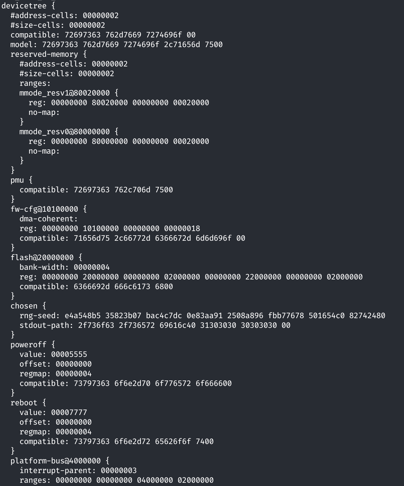
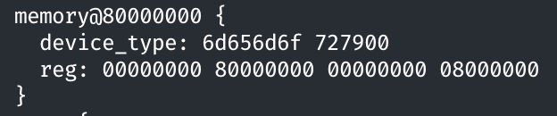

# 第二次实验报告

物理内存和页表

`pmm_init` 之后的内存布局

```text

+-----------------+ <-- vma: 0xffffffffc0200000
|                 |     pma:         0x80200000
|      KERNEL     |
|                 |
+-----------------+ <-- pma:         0x80206470
|       HOLE      | ---------------> ROUNDUP
+-----------------+ <-- pma:         0x80207000
|                 |
|     `Page`s     | ---------------> Array of `Page` structs
|                 |
+-----------------+ <-- mem_begin (ROUNDUP, but the same)
|                 |     pma:         0x80347000
|       Mem       |
|                 |
+-----------------+ <-- mem_end (ROUNDDOWN, but the same)
                        pma:         0x88000000
```

## Firsr-fit 连续物理内存分配算法

在 `pmm_init` 之后，会使用 `pa2page` 将 `mem_begin` 对应的物理地址转换为对应的 `Page`。并与 `mem_begin` 到 `mem_end` 这一段内存中包含的页的数量一起传入 `init_memmap`，之后再调用 `pmm_manager` 的 `init_memmap`。

## Best-fit 连续物理内存分配算法

## Buddy System

## Slub

## 硬件可用物理内存范围的获取方法

OpenSBI 在进入下一个启动阶段前会将扁平化的设备树位置写入内存中，并且将设备树对应的内存物理地址存入 `a1` 寄存器（第二个参数）中。因此，可以通过 `a1` 寄存器获取设备树的物理地址，然后根据设备树的格式进行解析以尝试获取内存的大小。

此前在 `entry.S` 中修复了页表的映射，将虚拟地址 `0x80000000` 位置的大页映射到了原先的物理地址：

```asm
boot_page_table_sv39:
    .zero 8 * 2
    .quad (0x80000 << 10) | 0xcf # VRWXAD
    # 0xffffffff_c0000000 map to 0x80000000 (1G)
    # 前 511 个页表项均设置为 0 ，因此 V=0 ，意味着是空的(unmapped)
    .zero 8 * 508
    # 设置最后一个页表项，PPN=0x80000，标志位 VRWXAD 均为 1
    .quad (0x80000 << 10) | 0xcf # VRWXAD

```

所以此处可以直接用物理地址来访问设备树。

### 设备树的格式

在 `libs/` 目录下编写了 `fdt.h` 实现简单的设备树解析和输出的功能。扁平化的设备树（Flattened Device Tree）的格式 [^1] 如下：

[^1]: [FDT 格式](https://devicetree-specification.readthedocs.io/en/stable/flattened-format.html)

```text
+--------------------------+
|    struct fdt_header     |
+--------------------------+
| memory reservation block |
+--------------------------+
|      structure block     |
+--------------------------+
|       strings block      |
+--------------------------+
```

其中由于对齐等原因，不同的区域之间可能存在空白。`fdt_header` 存储了整个设备树区域的整体信息，包括各个节的偏移量、总大小、版本等信息。具体的结构体内容见 `libs/fdt.h`。Memory reservation block 存储了被保留使用的内存区域，其存储格式为起始地址、大小这样一对数据的数组，二者均为 0 时表示数组结束。Structure block 中存储了设备树的结构信息，根据结构信息可以从 strings block 中获取对应的字符串。

在 structure block 中包括一些标识符，每个标识符后可能跟随着一些附加信息。

1. `FDT_BEGIN_NODE` 标识符后跟随着一个字符串，表示节点的名称。名称后对齐到四字节。
2. `FDT_END_NODE` 标识符后没有附加信息，表示节点的结束。
3. `FDT_PROP`：表示一个属性，标识符后跟随着一个结构体，包括这一属性值的长度以及属性名称在 strings block 中的偏移量。之后跟随着属性值，属性值之后会通过填充 0 对齐到 4 字节。
4. `FDT_NOP`：表示一个空节点，解析时直接跳过即可
5. `FDT_END`：表示设备树的结束。

### 设备树信息的使用

根据这些设备树的格式以及其中存储的信息可以直接解析设备树，获取内存的大小。需要注意的是，FDT 在内存中使用大端序进行存储，所以很多值在使用前都需要进行大小端转换。

首先在 `init.c` 中需要获取参数

```c
int kern_init(uint32_t hartid, uintptr_t dtb_pa);
```

其中 `dtb_pa` 即为设备树的物理地址。将这一地址传入 `walk_print_device_tree` 函数从而输出设备树的内容。由于设备树中属性的值有不同的类型，包括字符串和数值等，输出时先全部使用值的格式进行输出。具体的实现见 `libs/fdt.h`。

最终可以得到类似如下格式的输出：



由于设备树很庞大，并且其中的约定也很多，所以此处只进行了解析，而没有将其中的值进行使用。可以在输出的结果中找到内存有关的设备树节点：



查看设备树的规范[^2]，第一个 `device_type` 是一个字符串，此处其实就是 `memory`，后面的 `reg` 属性存储了两个 64 位整数，表示起始地址和内存区域的长度，此处就是 `0x80000000` 和 `0x08000000`，表示 `0x80000000` 开头的 `0x08000000` 个字节的内存，即 QEMU 默认的 128 MiB 内存。

[^2]: [设备树规范](https://devicetree-specification.readthedocs.io/en/stable/index.html)

使用这一方法便可以读取可用物理内存的范围。
