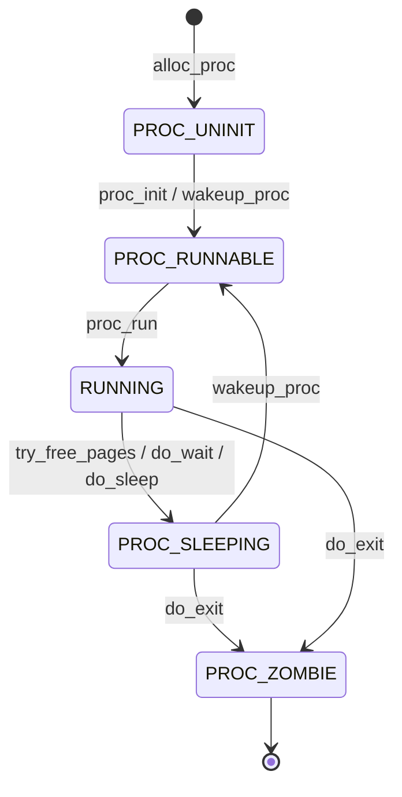

# 第五次实验报告

## 加载应用程序并执行

在 `do_execve` 中，我们需要将用户态的程序加载到内核态，然后执行。
`load_icode` 函数主要流程：
 1. 创建一个新的 `mm_struct`。
 2. 创建一个新的 PDT，将 `mm` 的 `pgdir` 设置为这个 PDT 的虚拟地址。
 3. 读取 ELF 格式，检验其合法性，循环读取每一个程序段，将需要加载的段加载到内存中，设置相应段的权限。之后初始化 BSS 段，将其清零。
 4. 设置用户栈。
 5. 设置当前进程的 `mm`, `cr3`, 设置 `satp` 寄存器
 6. 设置 `trapframe`，将 `gpr.sp` 指向用户栈顶，将 `epc` 设置为 ELF 文件的入口地址，设置 `sstatus` 寄存器，将 `SSTATUS_SPP` 位置 0，表示退出当前中断后进入用户态，将 `SSTATUS_SPIE` 位置 1，表示退出当前中断后开启中断。

### 用户态进程被选择到具体执行的详细过程

在用户态进程被 ucore 选择占用 CPU 后，会首先将 `satp` 寄存器设置为用户态进程的页表基址，然后调用 `switch_to` 进行上下文切换，保存当前寄存器状态到之前的 `context` 中，然后将要执行的进程的 `context` 中的寄存器状态恢复到寄存器中，使用 `ret` 指令跳转到 `ra` 寄存器指向的地址处继续执行。而在 `copy_thread` 函数中已经将 `ra` 寄存器设置为了 `forkret` 函数的地址，所以会跳转到 `forkret` 函数中，转而执行 `forkrets(tf)`，转而执行 `RESTORE_ALL`，由于已经在 `load_icode` 将 `SSTATUS_SPP` 设置为 0，因此不执行跳转，保存内核态栈指针，恢复 `sstatus` 和 `sepc` 以及通用寄存器，然后执行 `sret` 指令回到用户态，跳转到 `sepc` 指向的地址处，即 ELF 文件的入口地址，从而执行用户态程序。

### 给出ucore中一个用户态进程的执行状态生命周期图

