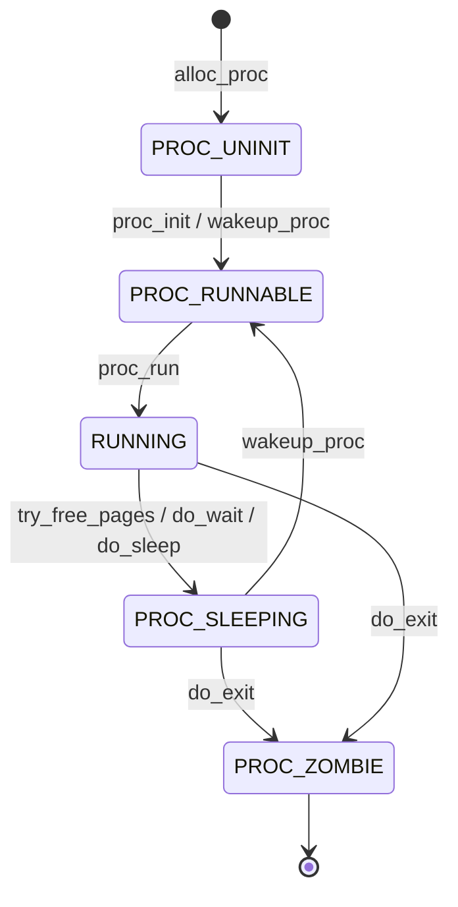

# 第五次实验报告

## 加载应用程序并执行

在 `do_execve` 中，我们需要将用户态的程序加载到内核态，然后执行。
`load_icode` 函数主要流程：
 1. 创建一个新的 `mm_struct`。
 2. 创建一个新的 PDT，将 `mm` 的 `pgdir` 设置为这个 PDT 的虚拟地址。
 3. 读取 ELF 格式，检验其合法性，循环读取每一个程序段，将需要加载的段加载到内存中，设置相应段的权限。之后初始化 BSS 段，将其清零。
 4. 设置用户栈。
 5. 设置当前进程的 `mm`, `cr3`, 设置 `satp` 寄存器
 6. 设置 `trapframe`，将 `gpr.sp` 指向用户栈顶，将 `epc` 设置为 ELF 文件的入口地址，设置 `sstatus` 寄存器，将 `SSTATUS_SPP` 位置 0，表示退出当前中断后进入用户态，将 `SSTATUS_SPIE` 位置 1，表示退出当前中断后开启中断。

```cpp
//(6) setup trapframe for user environment
struct trapframe *tf = current->tf;
// Keep sstatus
uintptr_t sstatus = tf->status;
memset(tf, 0, sizeof(struct trapframe));
tf->gpr.sp = USTACKTOP;
tf->epc = elf->e_entry;
// Set SPP to 0 so that we return to user mode
// Set SPIE to 1 so that we can handle interrupts
tf->status = (sstatus & ~SSTATUS_SPP) | SSTATUS_SPIE;
```
### 用户态进程被选择到具体执行的详细过程

在用户态进程被 ucore 选择占用 CPU 后，会首先将 `satp` 寄存器设置为用户态进程的页表基址，然后调用 `switch_to` 进行上下文切换，保存当前寄存器状态到之前的 `context` 中，然后将要执行的进程的 `context` 中的寄存器状态恢复到寄存器中，使用 `ret` 指令跳转到 `ra` 寄存器指向的地址处继续执行。而在 `copy_thread` 函数中已经将 `ra` 寄存器设置为了 `forkret` 函数的地址，所以会跳转到 `forkret` 函数中，转而执行 `forkrets(tf)`，转而执行 `RESTORE_ALL`，由于已经在 `load_icode` 将 `SSTATUS_SPP` 设置为 0，因此不执行跳转，保存内核态栈指针，恢复 `sstatus` 和 `sepc` 以及通用寄存器，然后执行 `sret` 指令回到用户态，跳转到 `sepc` 指向的地址处，即 ELF 文件的入口地址，从而执行用户态程序。

## 父进程复制自己的内存空间给子进程

在 `copy_range` 中实现了将父进程的内存空间复制给子进程的功能。逐个内存页进行复制，首先找到父进程的页表项，然后创建一个子进程新的页表项，设置对应的权限，然后将父进程的页表项对应的内存页复制到子进程的页表项对应的内存页中，然后将子进程的页表项加入到子进程的页表中。

```cpp
void *src_kvaddr = page2kva(page); // 父进程的内存页的 kernel addr
void *dst_kvaddr = page2kva(npage); // 子进程的内存页的 kernel addr
memcpy(dst_kvaddr, src_kvaddr, PGSIZE); // 复制内存页
ret = page_insert(to, npage, start, perm); // 将子进程的页表项加入到子进程的页表中
```

### 如何实现 Copy on Write 机制

要实现 Copy on Write 机制，可以在复制父进程的内存空间给子进程时，不复制整个内存页，而是只复制页表项，然后将父进程和子进程的页表项的权限都设置为只读。这样两个进程都可以访问同一个内存页，当其中一个进程要写入时，会触发缺页异常，然后在缺页异常处理函数中，复制整个内存页，设置可写入权限，这时就可以写入了。当某个共享页面只剩下一个进程时，就可以将其权限设置为可写。

## 理解进程执行 fork/exec/wait/exit 的实现，以及系统调用的实现

### fork

用户态：
`fork()` -> `sys_fork()` -> `do_fork()` -> `syscall(SYS_fork)` -> `ecall` 

内核态：
`syscall()` -> `sys_fork()` -> `do_fork(0, stack, tf)`

`do_fork`中，调用 `alloc_proc` 分配一个 `proc_struct`，并设置父进程。调用 `setup_kstack` 为子进程分配一个内核栈，调用 `copy_mm` 根据 `clone_flag` 复制或共享 `mm`，调用 `copy_thread` 在 `proc_struct` 中设置 `tf` 和上下文，将 `proc_struct` 插入 `hash_list` 和 `proc_list`，调用 `wakeup_proc` 使新的子进程变为可运行状态，使用子进程的 pid 设置返回值

### exec

内核态：
kernel_execve() -> ebreak -> syscall() -> sys_exec() -> do_execve()

检查用户提供的程序名称是否合法。
如果当前进程的 mm 不为空，说明当前进程占用了内存，进行相关清理操作，包括切换到内核页表、释放进程的内存映射、释放页目录表、销毁进程的内存管理结构等。
调用 `load_icode` 函数加载用户提供的二进制文件，将其代码段加载到内存中。
使用 `set_proc_name` 函数设置进程的名称。

### wait
`prco_init()` ->`kernel_thread()` -> `init_main()` -> `do_wait()`

首先进行内存检查，确保 `code_store` 指向的内存区域可访问。遍历查找具有给定PID的子进程，若找到且该子进程的父进程是当前进程，将 haskid 标志设置为1。如果 pid 为零，将循环遍历当前父进程的所有子进程，查找已经退出的子进程。如果找到，跳转到标签 found。如果存在子进程，将当前进程的状态设置为 `PROC_SLEEPING`，等待状态设置为 `WT_CHILD`，然后调用调度器 `schedule()` 来选择新的可运行进程。如果当前进程被标记为`PF_EXITING`，则调用 `do_exit` 以处理退出,跳转到标签 repeat 继续执行。检查子进程是否是空闲进程 `idleproc`或初始化进程 `initproc`，如果是则触发 panic。存储子进程的退出状态，处理子进程退出并释放资源。

### exit

内核态：
`kernel_execve()`-> `ebreak` -> `syscall()` -> `sys_exec()` -> `do_execve()` ->`execve_exit` ->`do_exit`

`prco_init()` ->`kernel_thread()` -> `init_main()` -> `do_wait()` -> `do_exit`

检查当前进程是否是idleproc或initproc，若是则`panic`，获取内存管理结构，减少对内存管理结构的引用计数，如果引用计数降为零，代表没有其他进程共享该内存管理结构，那么清理映射并释放页目录表，最后销毁内存管理结构。最后，将当前进程的 `mm` 指针设置为 `NULL`。将进程的状态设置为 `PROC_ZOMBIE`，表示进程已经退出。如果父进程正在等待子进程退出，则唤醒当前进程的父进程。然后，通过循环处理当前进程的所有子进程，将它们的状态设置为`PROC_ZOMBIE`，并将其重新连接到初始化进程的子进程链表上。如果初始化进程也正在等待子进程退出，那么也唤醒初始化进程。最后，进行调度。


### 给出ucore中一个用户态进程的执行状态生命周期图

